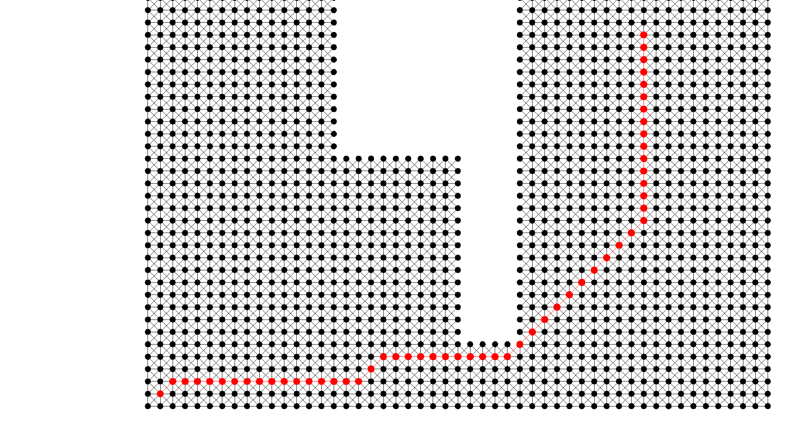

# Dijkstra's Shortest Path

Dijkstra's algorithm implementation with visualization



## Quickstart

```console
cabal run
```

## Features

- [X] Basic visualization
- [X] Working Dijkstra's algorithm implementation
- [X] Iterative animation for algorithms
- [ ] Working A* implementation
- [ ] Different graph views
- [ ] Graph editor
